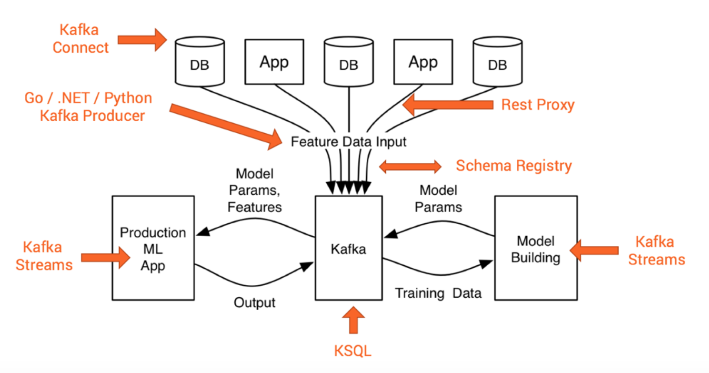
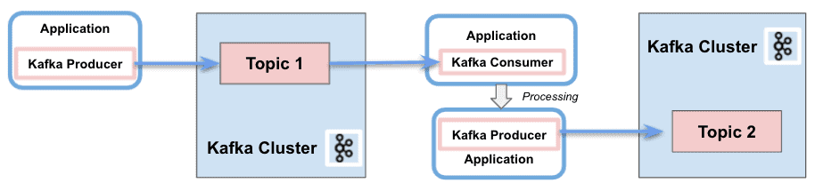
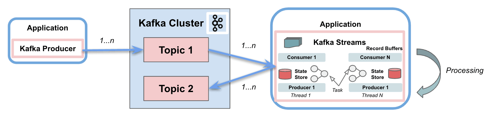
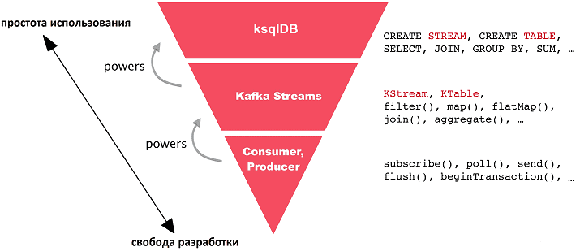
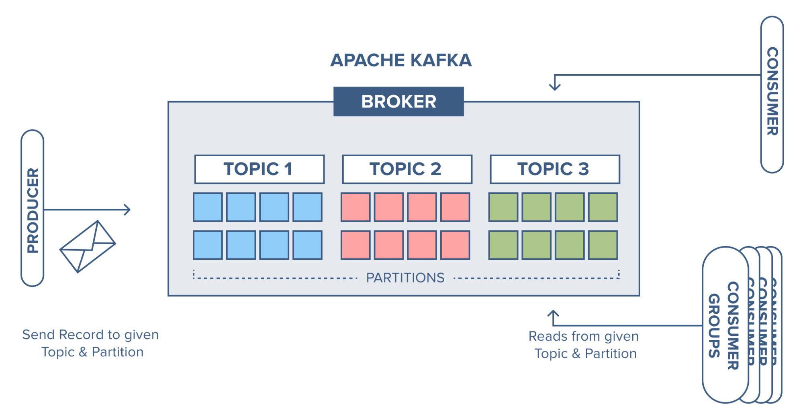
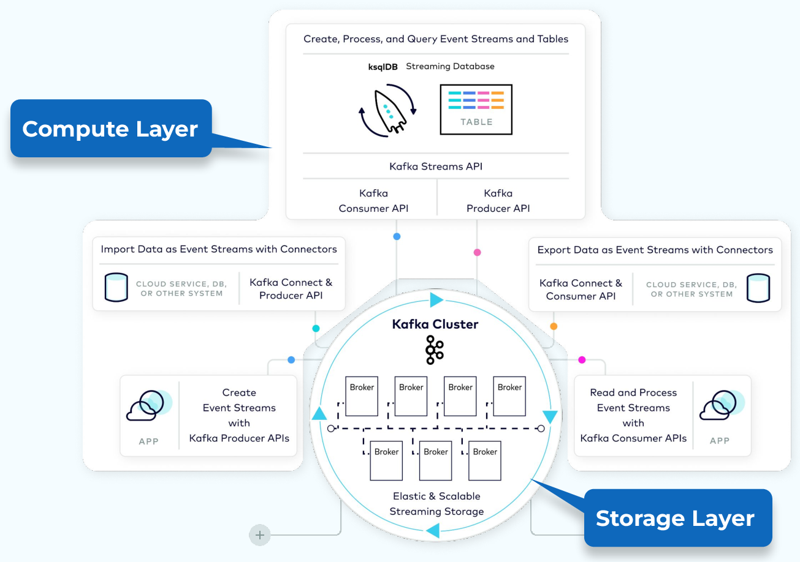
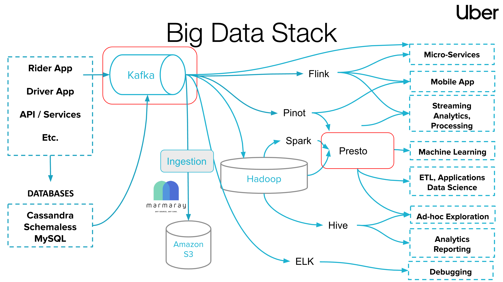

---
class:
  - lead
size: 16:9
paginate: true
headingDivider: 2 
marp: true

---

# Kafka
   Быстрее, чем message broker
\+ Надежнее, чем message broker 
**= Больше, чем message broker**

# Что увидим
 

1.	[Брокер сообщений Kafka vs MQ Broker. В чем разница](#3) \[ 3 ]
1.	[Что не есть кафка](#4) \[ 4 - 6 ]
1.	[Что внутри, зачем AVRO](#7) \[ 7 - 8 ]
1.	[Что за Kstream, разница Broker vs kStream](#9) \[ 9 - 14 ]
1.	[Кластер](#15) \[ 15 - 18 ]
1.	[Почему кафка = быстро, хотя есть диск?](#19) \[ 19 ]
1.	[Вариант применения](#20) \[ 20 ]
1.	[Как в мире сделано. пример Uber](#21) \[ 21 ]
2.  [Полезные ссылки](#22) \[ 22 ]

 
# Сравнение - MQ vs Kafka cluster

|Уровень | Базис | Rabbit MQ | Active MQ | Kafka cluster|
|:-|:-:|:-|:-|:-|
|Client |Consumer|push|pull|pull|
|Broker |Routing Key (P+S+C)| 2 + 2 + 0| 0 + 2 + 0 | 0 + 2 + 2|
|Broker |Сбой узла|stand-alone = потеря сообщений|Active-StandBy  NAS для сообщений |active-active NAS + Sink (Hadoop, S3) |
|Queue | Consumer |1 на очередь| >1 на очередь| >1 на очередь|
|Queue | Новая очередь|Producer акцептует| без уведомления Producer| + есть авто_очередь|
|Message| нет получателя | нельзя отправить | засоряется очередь | засоряется очередь |
|Message| сохранность | dead letter, первый прочитал - удалено | last ack, последний прочитал - удалено| есть возможность читать пачками, перечитывать, дообогащать|

# Kafka - это НЕ
1) сервис\система для обмена большими данными. Оркестратор - да. Существуют способы извлечения больших данных (streams, kSQL), но топики оптимальны для < 10 Mb единичных сообщений.
2) прокси-сервер для миллионов клиентов (вроде мобильных приложений), но существуют Kafka-нативные прокси вроде REST или MQTT;
3) платформа управления API, но эти инструменты обычно сопутствуют и используются для создания, управления жизненным циклом или монетизации API Kafka;
4) база данных для сложных запросов и пакетной аналитики, но он подходит для транзакционных запросов и относительно простых агрегаций, особенно с ksqlDB;
5) IoT-платформа с функциями управления устройствами, но возможна прямая Kafka-нативная интеграция с (некоторыми) IoT-протоколами вроде MQTT или OPC-UA;
6) технология для приложений строго в реальном времени вроде критических для безопасности или детерминистских систем, но это верно и для любого другого фреймворка.

# Kafka cluster - что у тебя внутри (часть 1)?
1) **Топология**: Топология представляет собой ориентированный ациклический граф обработки потока, который состоит из источников, процессоров и хранилищ состояния. Топология определяет, как данные будут обрабатываться и перемещаться по системе.
2) **KStream**: KStream представляет собой поток записей, где каждая запись представляет собой пару ключ-значение. KStream в общем случае используется для представления данных в режиме реального времени.
3) **KTable**: KTable представляет собой поток записей, которые представляют собой снимок состояния в определенный момент времени. Каждый ключ в KTable связан с наиболее актуальным значением. Когда новая запись с существующим ключом добавляется в KTable, старая запись заменяется новой.
4) **GlobalKTable**: GlobalKTable аналогичен KTable, но данные в GlobalKTable реплицируются во все экземпляры приложения, в отличие от KTable, где данные распределяются по различным экземплярам приложения.

# Kafka cluster - что у тебя внутри (часть 2)?
5) **State Stores**: Состояние приложения, такое как KTable и окна, помещается в хранилища состояний. Эти хранилища могут быть персистентными или не персистентными, и они могут быть отключены для операций, которые не требуют сохранения состояния.
6) **Stream Processors**: Процессоры используются для выполнения пользовательской логики обработки. Вы можете определить свои собственные процессоры и связать их с KStream или KTable.
7) **Serdes**: Serde является аббревиатурой для сериализации (serialization) и десериализации (deserialization). В Kafka Streams вы используете Serdes для указания того, как данные должны быть преобразованы в байты для хранения в Kafka, и как эти байты должны быть преобразованы обратно в данные при чтении из Kafka.

# Kafka cluster, зачем AVRO?
**AVRO** - схема и систем сериализации данных. Упаковщик JSON данных в бинарный формат для Брокера. При включении на топике гарантирует форматно-логический контроль и отклоняет попытки отправить данные вне списка зарегистрированных схем. Кратно ускоряет обмен сообщениями за счет контейнеризации, но требует дополнительных мощностей на сериализации и десериализацию в конечных точках.

1) Если Broker в топике Кафка используется AVRO, то это должно быть известно отправителям и получателям, так как на producer и concumer необходимы соответствующие версии схем и\или интерсепторы
2) Для kStreams (так как преобразование проходит в кластере Kafka) - отправитель и получатель могут общаться обычными сообщениями. 

# Kafka cluster, как AVRO ускоряет?

1) Эволюция схем данных на заявленную глубину хранения нативно поддерживается в кластере (serdes.avro.SpecificAvroSerde)
   1) Минимум знаний на Клиенте
   2) В каждом сообщении есть ссылка на ID схемы
   3) Из реестра схем кластера по ID можно получить спецификацию
2) При использовании AVRO упаковка данных в топике может стать пакетной
   1) Перенос в NAS и Tiered storage в пакетном режиме ускоряют доставку по запросу
   2) Построение пакета OffSet занимает меньше ресурсов на десериализацию
3) Поддержка прямой и обратной совместимости могут добавить нагрузку на системных аналитиков, если отсутствует Data Lineage 
   1) Из схемы топика системы-источника нельзя удалить атрибут, на который ссылается хотя бы одна трансформация в kStreams
   2) В схему топика системы-получателя нельзя добавить кастомное поле вне схемы AVRO

# Topic vs Streams

# Topic vs Streams
1) **Topic (Топик)** – неограниченный, постоянно обновляемый набор данных или упорядоченная, воспроизводимая и отказоустойчивая последовательность неизменяемых записей, каждая из которых определяется как пара «ключ-значение» (key-value), где ключи и значения — это обычные массивы байтов 
1) **Stream (Поток)** – полная история всех случившихся событий, топик со схемой данных (schema), где ключи и значения уже не байтовые массивы, а имеют определённые типы. 

**Broker** предназначен для передачи событий AS IS. Умеет фильтровать и сплиттить потоки. Поддерживает вытесняемое и обновляемое хранение событий, сегментированное по каждому топику.

**Kafka streams** - это фреймворк, расширяющий возможности Broker для непрерывной сквозной обработки топиков кластера, повышает эффективность работы в "реальном времени". Предназначен в первую очередь для фильтрации, дообогащения и трансфомации событий без нагрузки на системы-источники.

# С потоком (Streams) можно работать тремя способами:
1) **Оффсет** - перепроигрывание всех событий с отметки времени
   1) В Broker - только события из топика системы-источника
   2) В kStrems - дообогащенные, фильтрованные, трансформированные события
2) **Снепшот** - получение состояния в отметку времени
   1) для Broker - неприменимо
   2) для kStreams - запрос типовой
3) **KSQL** - аналитические запросы
   1) Так как является альтернативой kStreams, то больше предназначен для постобработки (например, через Spark)
   2) Но, выгоднее транслировать состояние kTable в S3 или Hadoop, так как поддержка горячего кэша в Kafka несет накладные расходы 
# Быстрее или проще ?

# Kafka topic

**Kafka только MQ - самограничения**
1) Data = Plain Text (csv,xml,json)
   - на брокере и кластере AVRO, Protobuf не используется
   - форматно-логический контроль только на клиенте
   - Хранение каждого сообщения "сжатым", дороже ОффСет
2) Messages "As Is"
   - дообогащение из соседних очередей невозможно
   - фильтрация для очередей только по заголовкам
   - Снепшоты, пакеты, дедупликация - невозможны
   - Обращение в kTable (kSQL) - всегда построчный парсинг
3) Event Stream = Queue
   - Отправителю нужны активные читатели
   - Невозможна автоподписка и создание виртуальных очередей
4) Tiered Storage - отсутствует, только NAS
   - Данные на диске - это копии сообщений из очередей
   - запрос ОффСет может вызвать ребалансировку (см 1)

# Kafka MQ vs Streams
|**Критерий** | **MQ** | **Streams** |
|:-|:-|:-|
|Деление логики Producer и Concumer| тоньше Producer, толще Concumer| логика на Cluster|
|stateful-операции|нет|да|
|поддержка многопоточности и параллелизма|Нет|Да|
|Количество кластеров| много| 1|

Если нужно распараллеливание потоковой stateful-обработки внутри экземпляра приложения в пределах одного кластера без разделения на производство и потребление событий, библиотека Kafka Streams будет отличным выбором.

# Kafka cluster - что у тебя внутри (обобщая)?

# Kafka cluster может больше, чем только брокер
> Нативные языки для Kafka Streams - java, scala

- **Interceptor (перехватчик)** - плагин на стороне клиента, мутирующий сообщение. (Producer, concumer). Предназначен для вызова kafka cluster методов без разработки на клиенте. Например, подписание, конвертация, фильтрация, проверка формата..
- **Connector (подключение)** - аналог dbLink на SQL базах. Программный код доступа к данным, для любых действий в рамках ролевой структуры
- **Worker (исполнитель)** - клиентская библиотека\надстройка Connector для исполнения пулла заданий (Task)
- **Task (задание)** - аналог Package или Job в SQL базах, повторяемое типовое действие с данными

#### внедрение AVRO ускорит работу.
- Эволюция схем данных на заявленную глубину хранения нативно поддерживается в кластере (serdes.avro.SpecificAvroSerde)
- Поддержка прямой и обратной совместимости могут добавить нагрузку на системных аналитиков
   - Из схемы топика системы-источника нельзя удалить атрибут, на который ссылается хотя бы одна трансформация в kStreams
   - В схему топика системы-получателя нельзя добавить кастомное поле вне схемы AVRO

# Kafka - это База Данных, НО
1) Стоимость поддержки горячего слоя хранения должно быть оправдано бизнес-выгодой
2) Охлажденное и/или постоянное хранение данных (особенно для больших данных, аналитических запросов, отчетов и построения срезов на больших данных) 
3) доставка большого результата через топики 
   1) при паджинации надо учитывать, FIFO - не про kafka
   2) без паджинации большие сообщения нуждаются в мощностях на резервирование и балансировку кластера 

# Kafka - это Message Broker, НО
1) REST и GRPC - это НЕ брокер, это подключение в кластер и свои расходы
2) FIFO и Poin-2-Point - отсутствуют, только программно через API на кластере
3) У каждого Топика с высокой интенсивностью обмена должна быть своя партиция
4) Ребалансировка кластера - одна из самых дорогих для Kafka, как и другого кластера
5) Переотправка с даты OffSet требует ресурсов на подготовку пакета сообщений
6) Хранение данных для глубины OffSet без Tiered Storage - нагрузка на RAM + CPU

# Почему кафка - быстро, хотя есть диск?
> Любую программу можно написать хуже на любом языке программирования

### Первично - способ хранения и распространения 
1. Балансировка доступа (Zookeper) выбирает самый свободный брокер для обработки запроса
2. Партиционирование данных по очередям позволяет распределить нагрузку на чтение
3. Сегментирование каждой очереди на партицию позволяет быстро реплицировать данные через единый журнал логов
4. Пакетная обработка (группировка, сжатие данных) уменьшает нагрузку на сеть

### Вторично - обращение к диску \ хранилищу
1. Резервное копирование на диск журнала логов добавляет надежности
2. Организация Tiered Storage позволяет экономить память, охлаждая данные на Hadoop или S3

## Kafka для сбора и распространения котировок (пример)
1) Кластер поддерживает разную частоту обновления источников 
   1) Котировки инструментов меняются часто
   2) Корпоративные события случаются реже
   3) Новые финанасовые инструменты появляются ещё реже
2) Из кластера Kafka запросом в kStreams можно получить связанную информацию
   1) Публиковать в очередь\топик дообогащенный json
        - на входе от QUIK похожее на "TQBR, SBERP, 2024-06-03 10:59:32.087, 312.99"
        - на выходе JSON, в котором указаны корпоративные идентификаторы на  эмитента, биржу, площадку, валюту, маркет-мейкера.. 
3) Low code решения через Stream Appps
   1)  (kafka) -- построить виртуальную очередь для публикации всех биржевых котировок по бондам, где эмитент = Сбер, а market maker = "доступная биржа"
   2)  (Cassandra) -- получить снепшот данных "все бонды России, допущенные к торгам на 1 марта 2024 года с котировками на ЕОД 1 июня" и создать виртуальный топик для публикации котировок только по ним с частотой "каждый торговый час в HH:15 минут"

#	Как в мире сделано. пример Uber

# Полезные ссылки (внешние)
 
1) https://www.confluent.io/blog/kafka-streams-tables-part-1-event-streaming
1) https://docs.confluent.io/platform/current/streams/developer-guide/datatypes.html
1) https://habr.com/ru/companies/maxilect/articles/537344/
1) https://habr.com/ru/articles/775900/
1) https://habr.com/ru/companies/mws/articles/725686/
1) https://habr.com/ru/articles/760934/
1) https://www.kai-waehner.de/blog/2020/03/12/can-apache-kafka-replace-database-acid-storage-transactions-sql-nosql-data-lake/
1) https://www.baeldung.com/java-kafka-streams-vs-kafka-consumer
1) https://kafka-school.ru/blog/kafka-streams-building/
1) https://bigdataschool.ru/blog/ksqldb-vs-kafka-streams-advantages-and-drawbacks.html
1) https://bigdataschool.ru/blog/kafka-streams-vs-consumer-api.html
